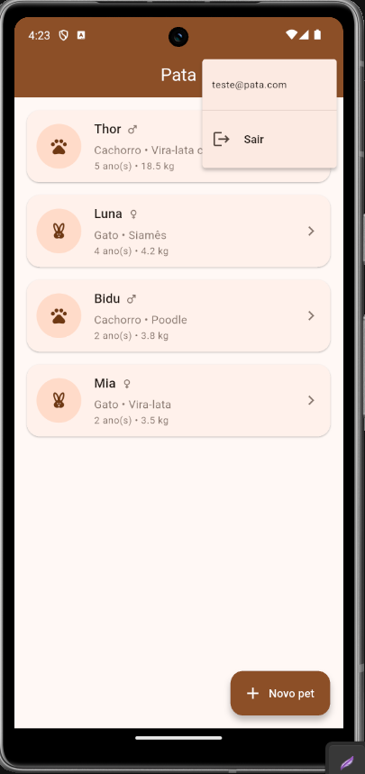

# Pata

Aplicativo que conecta o órgão fictício de proteção animal Pata a
pessoas interessadas em adotar: de um lado, facilita o cadastro e a
gestão dos cães e gatos disponíveis pelos responsáveis do órgão; do
outro, ajuda quem quer adotar a encontrar e conhecer esses animais —
funcionando como um pequeno marketplace de adoção.

## Objetivo do aplicativo

A visão completa do produto é servir um órgão fictício de proteção animal
(Pata): centralizar o cadastro dos cães e gatos recolhidos/disponíveis
e permitir que qualquer pessoa consulte quais animais estão disponíveis
para adoção, como um pequeno "marketplace" de adoção. O app terá dois
perfis de uso: responsáveis pelo órgão, que cadastram e mantêm os
dados dos animais, e adotantes, que apenas consultam os animais
disponíveis.

Nesta primeira etapa do trabalho 1, como contas de usuário e perfis de
acesso ainda não fazem parte do escopo, o app implementa a base do
cadastro a parte usada pelo perfil responsável: permitir cadastrar,
listar, ver detalhes e excluir animais. A diferenciação entre os dois
perfis e a visão somente-leitura para adotantes será implementada no
Trabalho 2, junto com o Firebase Authentication, e o vínculo dos dados a
cada conta no Trabalho 3, com o Cloud Firestore.

## Tema/dominio escolhido

Gerenciador de cuidados com pets. Entidade principal: Pet. Nesta
etapa, o cadastro é restrito a cães e gatos.

## Funcionalidades desta etapa do Trabalho

- Onboarding de boas vindas 3 slides em uma única tela, com PageView;
- Listagem dos pets cadastrados (com dados mockados iniciais e apenas
  cães e gatos);
- Cadastro de um novo pet, com validação dos campos obrigatórios
  (nome, espécie, sexo, raça, data de nascimento, peso e vacinação);
- Visualização dos detalhes de um pet;
- Exclusão de um pet, com confirmação;
- Feedback visual (mensagens de sucesso eerro) em todas as ações;
- Navegação entre as telas com go_router.

> Autenticação, contas de usuário e persistência em nuvem não fazem parte desta etapa e serão implementadas nos próximos trabalhos, conforme o cronograma da disciplina.

## Tecnologias utilizadas

- [Flutter](https://flutter.dev) / Dart
- [go_router](https://pub.dev/packages/go_router) — navegação declarativa
- [provider](https://pub.dev/packages/provider) — gerenciamento de estado
- [intl](https://pub.dev/packages/intl) — formatação de datas
- [uuid](https://pub.dev/packages/uuid) — geração de identificadores únicos

## Arquitetura

O projeto segue uma organização feature-first, inspirada em Clean
Architecture, separando cada funcionalidade em três camadas:


lib/
  app/                     # bootstrap: providers, tema e rotas
  core/                    # código compartilhado entre features
    domain/                # contratos genéricos (ex.: Identifiable)
    theme/
    widgets/
  features/
    onboarding/
      presentation/          # modelo de UI + tela (sem domain/data: não há dado de negócio por trás, é conteúdo estático)
        models/               
        screens/
    pets/
      domain/              # entidades e contratos (Pet, PetRepository)
        entities/
        repositories/
      data/                # implementações concretas dos contratos
        repositories/      # InMemoryPetRepository (dados em memória)
      presentation/        # estado (Provider) e UI (telas/widgets)
        providers/
        screens/
        widgets/
  main.dart


Essa separação permite que, nas próximas entregas, a
InMemoryPetRepository seja substituída por uma implementação baseada em
Cloud Firestore sem que nenhuma tela precise ser alterada e as telas
conhecem apenas o contrato PetRepository, nunca a implementação
concreta.

## Como executar o projeto

Pré-requisitos: [Flutter SDK](https://docs.flutter.dev/get-started/install)
instalado e configurado.

```bash
flutter pub get
flutter run
```

Para rodar os testes:

```bash
flutter test
```

## Screenshots




## Próximas evoluções previstas

- **Trabalho 2:** integração com Firebase Authentication (cadastro, login,
  logout e recuperação de senha), incluindo os dois perfis de uso:
  responsável do órgão (cadastra/gerencia) e adotante (apenas consulta);
- **Trabalho 3:** persistência dos pets no Cloud Firestore, com dados
  vinculados ao usuário autenticado, controle de acesso por perfil e CRUD
  completo para o responsável;
- **Trabalho 4:** versão final do aplicativo (com vistas à publicação nas
  lojas Android/iOS).

## Observações conhecidas

- Nesta etapa não há diferenciação de perfil de usuário (responsável x
  adotante) nem controle de acesso, todo mundo que abre o app tem a
  mesma visão de cadastro/listagem/exclusão. Isso é esperado: perfis e
  permissões dependem de contas de usuário, que só entram no Trabalho 2
  com Firebase Authentication.
- Nesta etapa os dados são mantidos apenas em memória: ao fechar o app,
  os cadastros feitos manualmente são perdidos (os pets iniciais voltam
  a aparecer). Isso é esperado e está de acordo com o Trabalho 1.
