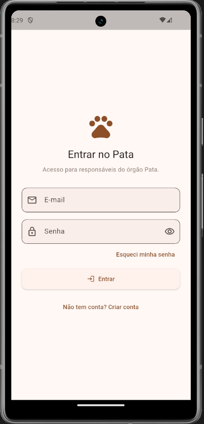
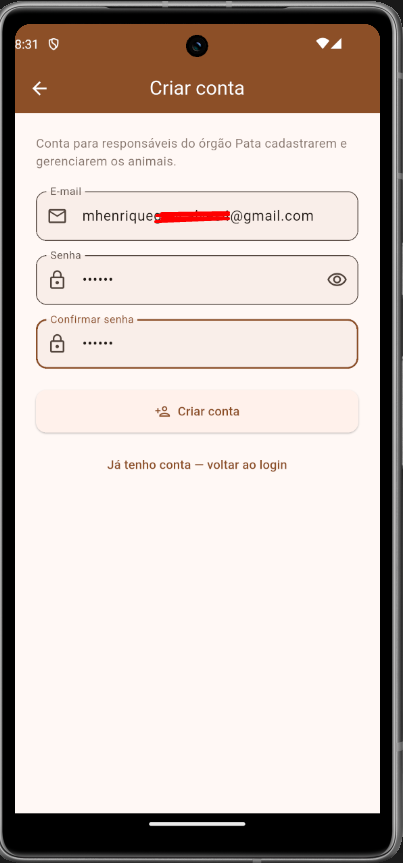
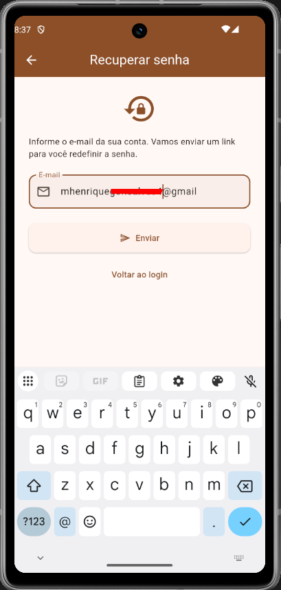

# Pata

Aplicativo que conecta o órgão fictício de proteção animal Pata a pessoas interessadas em adotar: de um lado, facilita o cadastro e a gestão dos cães e gatos disponíveis pelos responsáveis do órgão; do outro, ajuda quem quer adotar a encontrar e conhecer esses animais — funcionando como um pequeno marketplace de adoção.

Projeto da disciplina Desenvolvimento Móvel Faculdade Serra Dourada, prof. Guibson Krause. Este repositório já passou por duas entregas: Trabalho 1 (base Flutter) e Trabalho 2 (autenticação com Firebase).

## Objetivo do aplicativo

A visão completa do produto é servir um órgão fictício de proteção animal (Pata): centralizar o cadastro dos cães e gatos recolhidos/disponíveis e permitir que qualquer pessoa consulte quais animais estão disponíveis para adoção, como um pequeno "marketplace" de adoção. O app terá dois perfis de uso: responsáveis pelo órgão, que cadastram e mantêm os dados dos animais, e adotantes, que apenas consultam os animais disponíveis.

No Trabalho 1, como contas de usuário ainda não faziam parte do escopo, o app implementou só a base do cadastro (a parte usada pelo perfil responsável): cadastrar, listar, ver detalhes e excluir animais. No Trabalho 2, essa base ganhou autenticação de verdade com Firebase Authentication, o app já distingue quem está autenticado de quem não está, e as telas internas ficaram protegidas. A diferenciação entre os dois perfis (responsável x adotante) e o vínculo dos dados a cada conta ficam para o Trabalho 3, junto com o Cloud Firestore.

## Tema/domínio escolhido

Gerenciador de cuidados com pets. Entidade principal: Pet. Nesta etapa, o cadastro é restrito a cães e gatos.

## Funcionalidades implementadas desde o Trabalho 1

- Onboarding de boas vindas 3 slides em uma única tela, com PageView;
- Listagem dos pets cadastrados (com dados mockados iniciais, apenas cães e gatos);
- Cadastro de um novo pet, com validação dos campos obrigatórios (nome, espécie, sexo, raça, data de nascimento, peso e vacinação);
- Visualização dos detalhes de um pet;
- Exclusão de um pet, com confirmação;
- Feedback visual (mensagens de sucesso e erro) em todas as ações;
- Navegação entre as telas com go_router.

## Autenticação (novo no Trabalho 2)

- Cadastro de conta com e-mail e senha, com validação de formato de e-mail, senha mínima de 6 caracteres e confirmação de senha;
- Login com e-mail e senha, com mensagens de erro traduzidas e nunca uma exceção técnica do Firebase é mostrada direto ao usuário;
- Recuperação de senha por e-mail, usando o próprio Firebase;
- Logout, acessível pelo ícone de conta no canto superior direito da tela inicial (mostra o e-mail logado e a opção "Sair");
- Proteção de rotas: quem não está autenticado é redirecionado automaticamente para o login ao tentar acessar a listagem, o cadastro ou os detalhes de um pet; quem já está autenticado não consegue ficar "preso" nas telas de login/cadastro;
- Sessão persistida: ao reabrir o app já logado, uma tela de carregamento é exibida por um instante enquanto o Firebase confirma a sessão;
- Loading e bloqueio de múltiplos envios em toda operação assíncrona de autenticação.

Toda a lógica de autenticação fica isolada em `features/auth/`, nenhuma tela chama o Firebase diretamente.

## Tecnologias utilizadas

- Flutter / Dart
- Firebase Core + Firebase Authentication
- go_router — navegação declarativa e protegida por autenticação
- provider — gerenciamento de estado
- intl — formatação de datas
- uuid — geração de identificadores únicos

## Arquitetura

O projeto segue uma organização feature-first, inspirada em Clean Architecture, separando cada funcionalidade em três camadas:

lib/
app/ # bootstrap: providers, tema e rotas (rotas já com proteção por autenticação)
core/ # código compartilhado entre features
domain/ # contratos genéricos (ex.: Identifiable)
theme/
widgets/ # inclui a tela de carregamento inicial
features/
auth/
domain/ # AppUser, AuthFailure, AuthRepository (contrato)
data/ # FirebaseAuthRepository (única classe que importa o firebase_auth)
presentation/ # provider de autenticação + telas de login/cadastro/recuperação
onboarding/
presentation/ # modelo de UI + tela (sem domain/data: é conteúdo estático)
models/
screens/
pets/
domain/ # entidades e contratos (Pet, PetRepository)
entities/
repositories/
data/ # InMemoryPetRepository (dados em memória)
repositories/
presentation/ # estado (Provider) e UI (telas/widgets)
providers/
screens/
widgets/
firebase_options.dart # gerado pelo flutterfire configure
main.dart

Essa separação permite que, no Trabalho 3, a InMemoryPetRepository seja substituída por uma implementação baseada em Cloud Firestore sem que nenhuma tela precise ser alterada, as telas conhecem apenas os contratos (PetRepository, AuthRepository), nunca a implementação concreta. O mesmo já vale para o Firebase: só uma classe de todo o projeto sabe que ele existe.

## Como executar e configurar o projeto

Pré-requisitos: Flutter SDK, Firebase CLI e FlutterFire CLI instalados.

1. Crie um projeto em console.firebase.google.com;
2. Em Authentication → Sign-in method, habilite o provedor E-mail/senha;
3. Na raiz do projeto, rode `flutterfire configure` e selecione o projeto criado e a(s) plataforma(s) (recomendado: web);
4. `flutter pub get`
5. `flutter run -d chrome`

> O pacote firebase_auth não tem suporte oficial para Windows/Linux desktop — rode no Chrome ou em um emulador/dispositivo Android.

Para rodar os testes:

`flutter test`

## Screenshots

### Funcionalidades do Trabalho 1

### Funcionalidades adicionadas no Trabalho 2

## Próximas evoluções previstas

- Trabalho 3: persistência dos pets no Cloud Firestore, com dados vinculados ao usuário autenticado, controle de acesso por perfil (responsável x adotante) e CRUD completo;
- Trabalho 4: versão final do aplicativo (com vistas à publicação nas lojas Android/iOS).

## Observações conhecidas

- Ainda não há diferenciação de papel entre responsável do órgão e adotante, todo usuário autenticado vê a mesma área. Está previsto para o Trabalho 3.
- Os dados dos pets continuam mockados em memória: ao fechar o app, os cadastros manuais de pets são perdidos (os pets iniciais voltam a aparecer); a conta de usuário, porém, permanece criada no Firebase.
- O pacote firebase_auth não roda no target Windows desktop; use Chrome ou Android para testar o fluxo de autenticação.